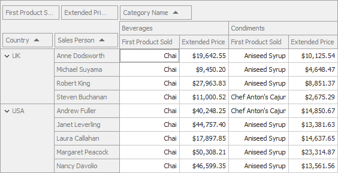

<!-- default badges list -->

[](https://supportcenter.devexpress.com/ticket/details/T1038519)
[](https://docs.devexpress.com/GeneralInformation/403183)
<!-- default badges end -->

# Pivot Grid for WinForms - How to Aggregate Data by the Field's First Value

This example shows how to aggregate data by the field's first value.

<!-- default file list -->
## Files to look at

* [Form1.cs](./CS/Win_Pivot_CustomAggregates/Form1.cs) (VB: [Form1.vb](./VB/Win_Pivot_CustomAggregates/Form1.vb))
* [Program.cs](./CS/Win_Pivot_CustomAggregates/Program.cs) (VB: [Program.vb](./VB/Win_Pivot_CustomAggregates/Program.vb))
* [FirstValueFunction.cs](./CS/Win_Pivot_CustomAggregates/FirstValueFunction.cs) (VB: [FirstValueFunction.vb](./VB/Win_Pivot_CustomAggregates/FirstValueFunction.vb))
<!-- default file list end -->


## Overview

This example adds the FirstValue([ProductName]) expression to the _First Sold Product_ field. The expression returns the first sold product by _Sales Persons_ in each product category.



| Data Field | Expression |
| --- | --- |
| First Sold Product | ``` FirstValue([ProductName]) ``` |

Call the [CriteriaOperator.RegisterCustomFunction](https://docs.devexpress.com/CoreLibraries/DevExpress.Data.Filtering.CriteriaOperator.RegisterCustomFunction(DevExpress.Data.Filtering.ICustomFunctionOperator)) method to register a custom function in your project (see [Program.cs](./CS/Win_Pivot_CustomAggregates/Program.cs#L18)/[Program.vb](./VB/Win_Pivot_CustomAggregates/Program.vb#L18))


## Documentation

## More Examples

[Pivot Grid for Web Forms - How to Aggregate Data by the Field's First Value](https://github.com/DevExpress-Examples/aspnet-pivot-grid-custom-aggregates)

